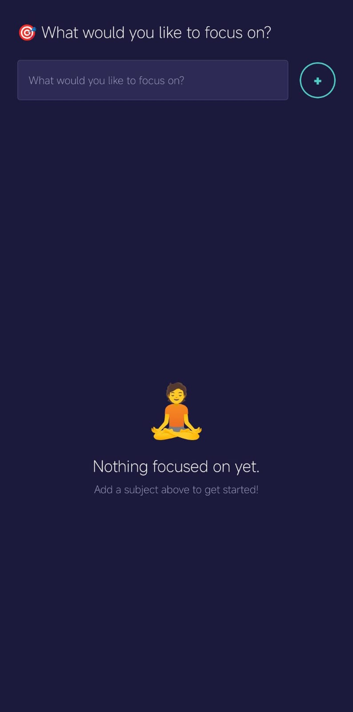
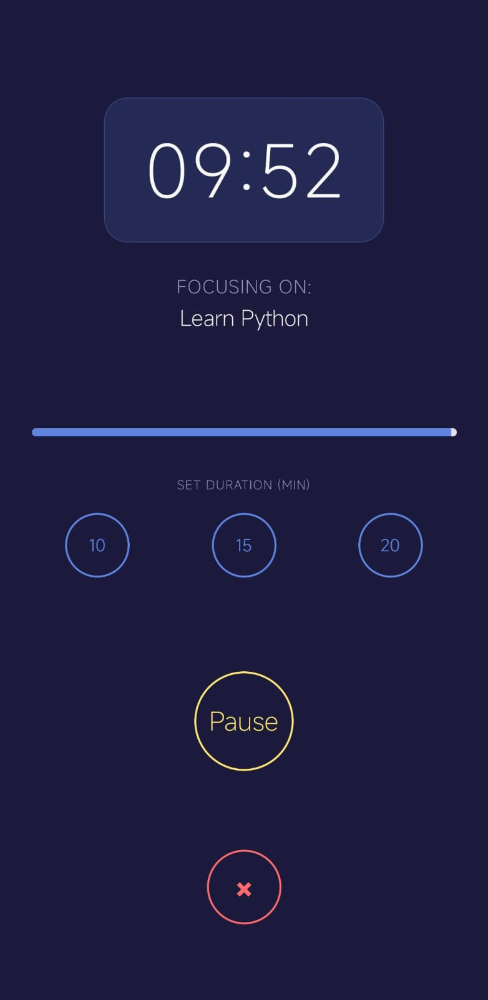

# 🍅 Pomodoro FocusTime

A clean, distraction-free **Pomodoro-based focus timer** built with **React Native** and **Expo** for Android. Set a subject, pick a duration, and stay locked in — the app keeps your screen awake and vibrates when the session ends.

---

## 📸 App Snapshots

<p align="center">
  
  &nbsp;&nbsp;&nbsp;
  
  &nbsp;&nbsp;&nbsp;
  
</p>

<p align="center">
  <em>Home Screen</em>
  &nbsp;&nbsp;&nbsp;&nbsp;&nbsp;&nbsp;&nbsp;&nbsp;&nbsp;&nbsp;&nbsp;&nbsp;&nbsp;&nbsp;&nbsp;&nbsp;&nbsp;&nbsp;&nbsp;&nbsp;&nbsp;&nbsp;
  <em>Focus History</em>
  &nbsp;&nbsp;&nbsp;&nbsp;&nbsp;&nbsp;&nbsp;&nbsp;&nbsp;&nbsp;&nbsp;&nbsp;&nbsp;&nbsp;&nbsp;&nbsp;&nbsp;&nbsp;&nbsp;&nbsp;&nbsp;&nbsp;&nbsp;
  <em>Timer Screen</em>
</p>

---

## ✨ Features

- **Add Focus Subjects** — type what you want to work on and hit ✚
- **Configurable Timer** — choose between 10, 15, or 20-minute focus sessions
- **Live Countdown** — real-time `MM:SS` display with progress bar
- **Vibration Alert** — device vibrates when the timer ends
- **Keep Awake** — screen stays on during active sessions
- **Focus History** — completed sessions are tracked and displayed on the home screen
- **Dark-Themed UI** — easy on the eyes with a sleek dark blue palette

---

## 🚀 Getting Started

### Prerequisites

- [Node.js](https://nodejs.org/) (v18+)
- [Expo CLI](https://docs.expo.dev/get-started/installation/) — `npm install -g expo-cli`
- Android device or emulator (via [Android Studio](https://developer.android.com/studio))

### Installation

```bash
# Clone the repository
git clone https://github.com/mohsinansari0705/Pomodoro-FocusTime-app.git
cd Pomodoro-FocusTime-app

# Install dependencies
npm install

# Start the development server
npm start
```

Scan the QR code with the **Expo Go** app on your Android device, or press `a` to launch in an Android emulator.

---

## 📜 License

This project is licensed under the [0BSD License](https://github.com/mohsinansari0705/Pomodoro-FocusTime-app/blob/main/LICENSE) — free to use with zero restrictions.

---

> *Stay focused. One session at a time.* 🍅